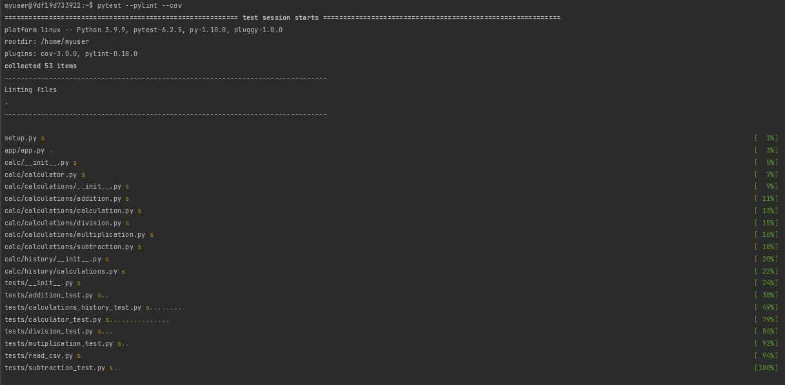
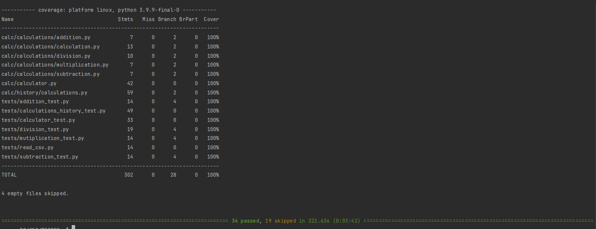

# Calculator Web Application

**The calculator web application is the program that
can do basic calculations for a user. 
The web application uses Flask, Jinja and Nginx.** 

## Website Link
[8.8.8.8](8.8.8.8)

## Functionality of the Application
The user can do addition, subtraction, multiplication and division of 
two values. It also shows the result of the calculation and shows a 
table on the history of calculations. The user can clear the history 
of calculations if the user wants to.

## Test Result

