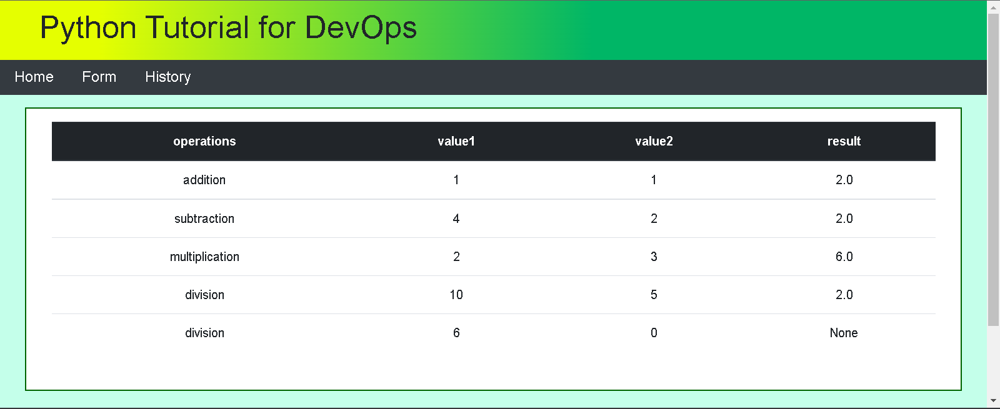

# Beautiful Tables

**The web application has a form where the user can do 
calculations. The app can display a beautiful table containing 
the history of calculations. The web application uses Flask and Jinja.**

## Result
 